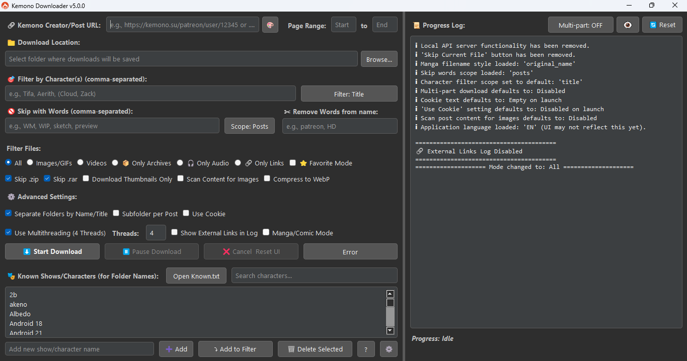
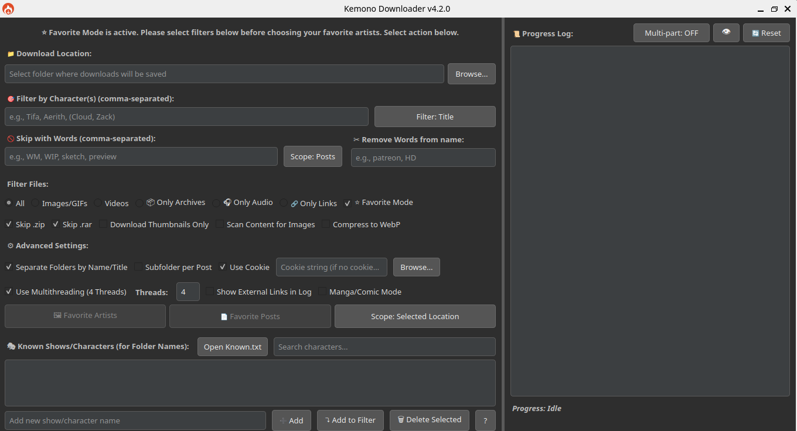
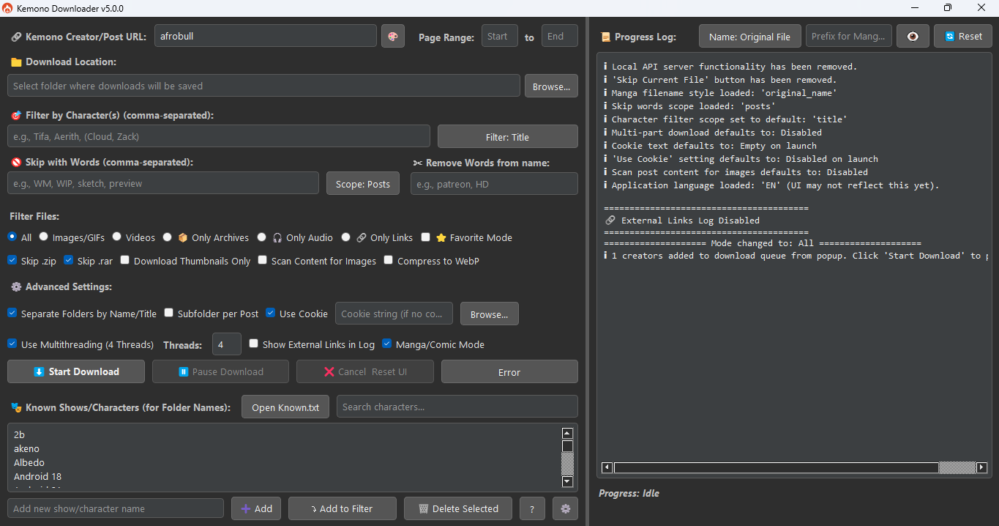
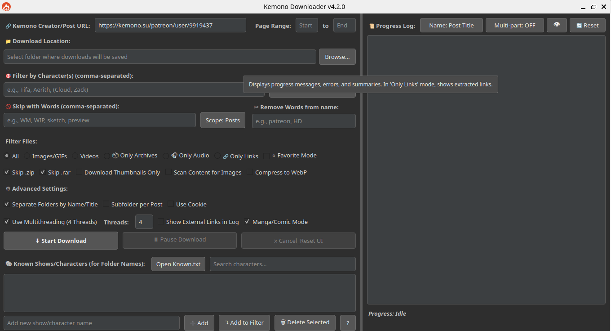

<h1 align="center">Kemono Downloader v5.0.0</h1>

<table align="center">
  <tr>
    <td align="center">
      
      <br>
      <strong>Default</strong>
    </td>
    <td align="center">
      
      <br>
      <strong>Favorite mode</strong>
    </td>
  </tr>
  <tr>
    <td align="center">
      
      <br>
      <strong>Single Post</strong>
    </td>
    <td align="center">
      
      <br>
      <strong>Manga/Comic Mode</strong>
    </td>
    <td align="center">
    </td>
  </tr>
</table>
---

A powerful, feature-rich GUI application for downloading content from **[Kemono.su](https://kemono.su)** (and its mirrors like kemono.party) and **[Coomer.party](https://coomer.party)** (and its mirrors like coomer.su).
Built with PyQt5, this tool is designed for users who want deep filtering capabilities, customizable folder structures, efficient downloads, and intelligent automation, all within a modern and user-friendly graphical interface.

*This v5.0.0 release marks a significant feature milestone. Future updates are expected to be less frequent, focusing on maintenance and minor refinements.*

<p align="center">
  <a href="features.md"><strong>📚 Full Feature List</strong></a> • 
  <a href="LICENSE"><strong>📝 License</strong></a>
</p>

---

## Feature Overview

Kemono Downloader offers a range of features to streamline your content downloading experience:

-   **User-Friendly Interface:** A modern PyQt5 GUI for easy navigation and operation.
-   **Flexible Downloading:**
    -   Download content from Kemono.su (and mirrors) and Coomer.party (and mirrors).
    -   Supports creator pages (with page range selection) and individual post URLs.
    -   Standard download controls: Start, Pause, Resume, and Cancel.
-   **Powerful Filtering:**
    -   **Character Filtering:** Filter content by character names. Supports simple comma-separated names and grouped names for shared folders.
    -   **Keyword Skipping:** Skip posts or files based on specified keywords.
    -   **Filename Cleaning:** Remove unwanted words or phrases from downloaded filenames.
    -   **File Type Selection:** Choose to download all files, or limit to images/GIFs, videos, audio, or archives. Can also extract external links only.
-   **Customizable Downloads:**
    -   **Thumbnails Only:** Option to download only small preview images.
    -   **Content Scanning:** Scan post HTML for `` tags and direct image links, useful for images embedded in descriptions.
    -   **WebP Conversion:** Convert images to WebP format for smaller file sizes (requires Pillow library).
-   **Organized Output:**
    -   **Automatic Subfolders:** Create subfolders based on character names (from filters or `Known.txt`) or post titles.
    -   **Per-Post Subfolders:** Option to create an additional subfolder for each individual post.
-   **Manga/Comic Mode:**
    -   Downloads posts from a creator's feed in chronological order (oldest to newest).
    -   Offers various filename styling options for sequential reading (e.g., post title, original name, global numbering).
-   **⭐ Favorite Mode:**
    -   Directly download from your favorited artists and posts on Kemono.su.
    -   Requires a valid cookie and adapts the UI for easy selection from your favorites.
    -   Supports downloading into a single location or artist-specific subfolders.
-   **Performance & Advanced Options:**
    -   **Cookie Support:** Use cookies (paste string or load from `cookies.txt`) to access restricted content.
    -   **Multithreading:** Configure the number of simultaneous downloads/post processing threads for improved speed.
-   **Logging:**
    -   A detailed progress log displays download activity, errors, and summaries.

---

## Installation

### Requirements
-   Python 3.6 or higher
-   pip (Python package installer)

### Install Dependencies
Open your terminal or command prompt and run:

```bash
pip install PyQt5 requests Pillow mega.py
```

### Running the Application
Navigate to the application's directory in your terminal and run:
```bash
python main.py
```

### Optional Setup
-   **Main Inputs:**
-   Place your `cookies.txt` in the root directory (if using cookies).
-   Prepare your `Known.txt` and `creators.json` in the same directory for advanced filtering and selection features.

---

## Troubleshooting

### AttributeError: module 'asyncio' has no attribute 'coroutine'

If you encounter an error message similar to:
```
AttributeError: module 'asyncio' has no attribute 'coroutine'. Did you mean: 'coroutines'?
```
This usually means that a dependency, often `tenacity` (used by `mega.py`), is an older version that's incompatible with your Python version (typically Python 3.10+).

To fix this, activate your virtual environment and run the following commands to upgrade the libraries:

```bash
pip install --upgrade tenacity
pip install --upgrade mega.py
```

---

## Contribution

Feel free to fork this repo and submit pull requests for bug fixes, new features, or UI improvements!

---

## License

This project is under the Custom Licence

## Star History

<table align="center" style="border-collapse: collapse; border: none; margin-left: auto; margin-right: auto;">
  <tr>
    <td align="center" valign="middle" style="padding: 10px; border: none;">
      <a href="https://www.star-history.com/#Yuvi9587/Kemono-Downloader&Date">
        
      </a>
    </td>
    <td align="center" valign="middle" style="padding: 10px; border: none;">
      
    </td>
  </tr>
</table>

👉 See [features.md](features.md) for the full feature list.
